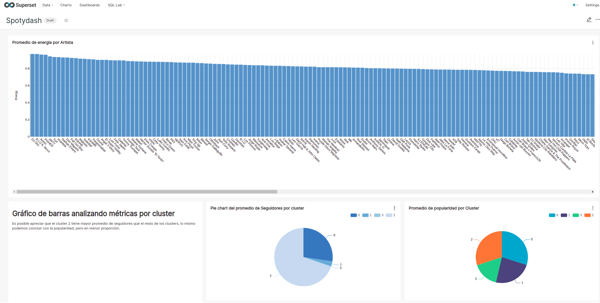

# Inspirado en
Karolina Sowinska - Data Engineering (Inglés)
https://www.youtube.com/playlist?list=PLNkCniHtd0PNM4NZ5etgYMw4ojid0Aa6i

CodinEric - Ejemplo de ETL con Spotify y Python (Español)
https://www.youtube.com/watch?v=eg8t2-E69ew&t=96s&ab_channel=CodinEric

Juan de Dios Santos - Is my Spotify music boring? An analysis involving music, data, and machine learning (Inglés)
https://towardsdatascience.com/is-my-spotify-music-boring-an-analysis-involving-music-data-and-machine-learning-47550ae931de


# Obtener credenciales de Spotify - IMPORTANTE PARA USAR LA API
Utilizar el siguiente link para crear una aplicación dentro de Spotify para poder generar un token de acceso.

https://developer.spotify.com/dashboard/login

# Documentación de los métodos utilizados:
- Artistas: https://developer.spotify.com/documentation/web-api/reference/#endpoint-get-an-artist
- Tracks/songs: https://developer.spotify.com/documentation/web-api/reference/#endpoint-get-several-audio-features
- Playlist: https://developer.spotify.com/documentation/web-api/reference/#category-playlists

# Extracción de datos
Utilizaremos la API de Spotify para extraer datos desde nuestra cuenta personal.

# Transformación de datos
Realizaremos procesos para extraer algunos campos a partir de los datos obtenidos desde la API de Spotify. Los mismos están definidos en el script `transform.py`.

# Entrenamiento del modelo.
Entrenaremos un modelo de K-means clustering con una configuración medio al azar por una cuestión de simplicidad. Este modelo está definido en el script `clustering.py`. El modelo a su vez es registrado junto a sus métricas, hiperparámetros y artefactos de interés por MLflow.

# Carga de datos
Cargar los datos transformados o los resultados de preddiciones de un modelo de ML en una base de datos PostgreSQL usando la librería `pangres`.


# COMO HACER EL SETUP DEL PROYECTO
Testeado con las versiones `19.03.3` de Docker y `1.28.4` de Docker Compose.

Nota: Asegurarte de tener bien configurado el archivo `.env` (Mirar más abajo).

Estamos utilizando `docker-compose` para correr este proyecto y `poetry` para crear nuestro propio virtual environment y gestionar nuestras librerías Python.

Primero, tenenemos que buildear la iamgen. Para ello iremos a la carpeta `docker` y correremos el siguiente comando en una consola (ya sea WSL2 o consola Bash):

```bash
docker-compose --env-file ../.env build
```

Y luego, para levantar los servicios definidos en `docker-compose.yaml` corremos:
```bash
docker-compose --env-file ../.env up
```

Nota: Es recomendable reiniciar los servicios de airflow dado que estamos haciendo una primera configuración, para ello hacemos:

```bash
docker restart spotydash_airflow-scheduler_1
```

```bash
docker restart spotydash_airflow-webserver_1
```

## Ejemplo de archivo .env (Necesario para la correcta configuración del proyecto)
Por favor, mirar el archivo `sample_dot_env` en la carpeta del proyecto.


# DASHBOARD
El dashboard está construido con la plataforma de visualización Apache Superset (Para más referenciar sobre cómo configurar un dashboard en 5 minutos usando Google Sheets como fuente de datos ver el siguiente tweet https://twitter.com/AldoEscobarLVP/status/1399163240735821825)




# ETLS - AIRFLOW
Este proyecto tiene 4 DAGs:

* songs_etl: Contiene un ETL para los datos de las canciones.
* artists_etfl: Contiene un ETFL para datos de artistas.

## SOBRE EL ARCHIVO .CACHE
El archivo `.cache` es generado por la API de Spotify cuando entras en la URI de redireccionamiento definida en Spotify. Es posible generarlo corriendo `etl_songs_data.py` o `etfl_artists_data.py` (El método`current_user_recently_played` de la API de Spotify lo genera).
Para correr los ETLs es necesario tener este file en  `/spotydash/spotydash/` (En caso de correr el script `etl_songs_data.py` / `etfl_artists_data.py`) o moverlo a la carpeta `/spotify_dash/spotydash/dags/` para correr los DAGs de Airflow. Para más referencias mirar el video de CodinEric.

# COMO ACCEDER A POSTGRESQL
Podemos correr queries a PostgreSQL, para ello, corremos lo siguiente (asegurarse de tener los servicios de docker levantados):

```bash
docker exec -it spotydash_postgres-db_1 psql -d spotipy -U spoty -p spoty -p 5432
```
